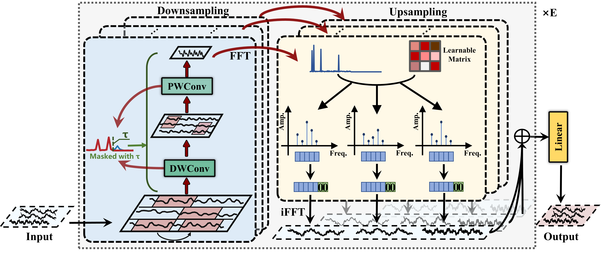
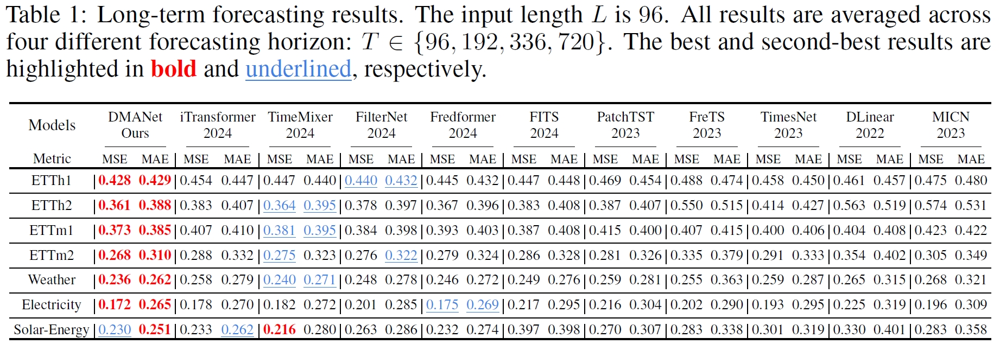

# DMANet: A Dynamic Multiscale Anti-Aliasing Network for Time Series Forecasting

This code is a PyTorch implementation of our paper **"DMANet: A Dynamic Multiscale Anti-Aliasing Network for Time Series Forecasting"**.

**[Highlight] This code is the version as of Feb 09, 2025, and the updated code will be released upon acceptance of the paper.** **The latest source code will be released when the paper is accepted.**

## Overall Architecture



## Result



## Platform

- NVIDIA 3090 24GB GPU, PyTorch

## Usage

1. Install Python 3.9. For convenience, execute the following command.

````
pip install -r requirements.txt
````

2. Prepare Data. You can obtain the well pre-processed datasets from [Google Drive](https://drive.google.com/drive/folders/13Cg1KYOlzM5C7K8gK8NfC-F3EYxkM3D2) or [Baidu Drive](https://pan.baidu.com/s/1r3KhGd0Q9PJIUZdfEYoymg?pwd=i9iy), then place the downloaded data in the folder ````./dataset````.

3. Train and evaluate model. We provide the experiment scripts for all benchmarks under the folder ````./scripts/.```` You can reproduce the experiment results as the following examples:


## Acknowledgement

We greatly appreciate the following GitHub repositories for their valuable code:

- https://github.com/thuml/Time-Series-Library
- https://github.com/kwuking/TimeMixer
- https://github.com/ts-kim/RevIN